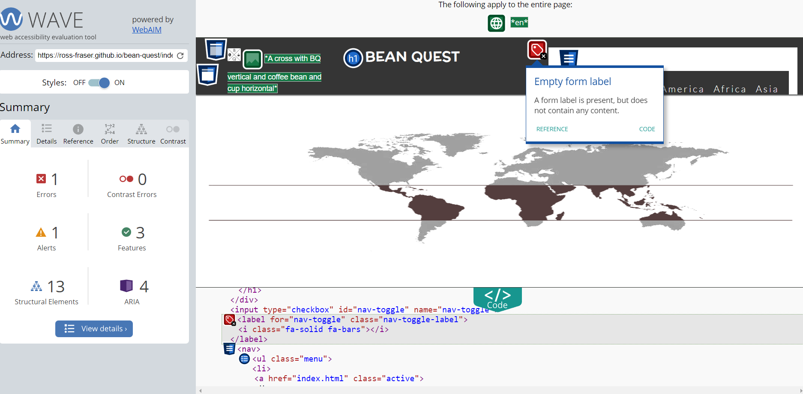

# Bean Quest

Bean Quest is a website dedicated to the exploration and celebration of the coffee belt regions around the world. If you're passionate about coffee, its origins, and the diverse cultures and landscapes that contribute to the coffee you love, you're in the right place!

About Bean Quest
Coffee is more than just a beverage; it's a journey that spans continents, climates, and cultures. Bean Quest seeks to connect coffee enthusiasts with the fascinating world of coffee production by offering in-depth information, and beautiful imagery about coffee belt regions.

The website is your passport to the coffee belt regions, providing a rich, multimedia experience that educates, inspires, and entertains. Discover the landscapes, and flavours that make coffee from each region unique.

## Key Objectives

Educate: Bean Quest aims to educate visitors about the coffee belt regions, the coffee-making process, and the unique qualities of coffee from each region.

Inspire: We want to inspire coffee lovers to explore the world of coffee beyond their cup and appreciate the cultural and environmental aspects of coffee production.

Entertain: We provide engaging images that make learning about coffee regions an enjoyable experience.
## Features

- Menu
- Map highlighting the coffee belt
- Social media links

## Sources

-freepik.com
## Usage/Examples

Visit ross-fraser.github.io/bean-quest/index.html
Browse through the coffee belt region profiles.
Visit our social media sites.

## Testing

- I confirmed that this project is responsive, looks good and functions on all standard screen sizes using the devtools device toolbar.

- I confirmed that the navigation header, Home, Latin-America, Africa and Asia text are all readable and easy to understand.

## Bugs

Unsolved Bugs

- There is an empty form label on the navigation toggle.
- There are 3 additional empty LinkedIn links on the additional pages.
## Validator Testing

- HTML
    - There was a "Trailing slash on void elements" error  when passing through the W3C HTML validator, which on discussing with my codeInstitute mentor was agreed to leave then in as it makes the code easier to read.

- CSS
    - No errors were found when passing  through the W3C (jigsaw) css validator.

- Accessibility
    - I confirmed that the colors and fonts are easy to read and accessible by running it through lighthouse in devtools as well as wave.webaim.org.
    
## Testing Screenshots

Lighthouse tests - mobile

Lighthouse tests - desktop

## Deployment

- The site was deployed to Github pages.
    - In the Github repository, navigate to the settings tab.
    - From the source section drop-down menu, select the master branch.
    - Once the master branch has been selected, the page provided a link to the deployed site.

## Credits

Content

- https://en.wikipedia.org/wiki/Coffea_canephora
- https://pebbleandpine.co.uk/pages/guide-african-coffee
- https://www.gustatory.co/blogs/fundamentals/coffee-profiles-by-continent#:~:text=Asian%20Coffees,in%20the%20world%20of%20coffee.
- https://www.gustatory.co/blogs/fundamentals/coffee -profiles-by-
continent#:~:text=Asian%20Coffees,in%20the
%20world%20of%20coffee.

Images

- https://sagebrushcoffee.com/blogs/education/history-of-latin-american-
coffee#:~:text=Arabica%20plants%20are%20the%20primary,in%20Africa%20and%20Southeast
%20Asia.
- https://sagebrushcoffee.com/blogs/education/history-of-latin-
american-coffee#:~:text=Arabica%20plants%20are%20the%20primaryin%20Africa%20and%20Southeast%20Asia.